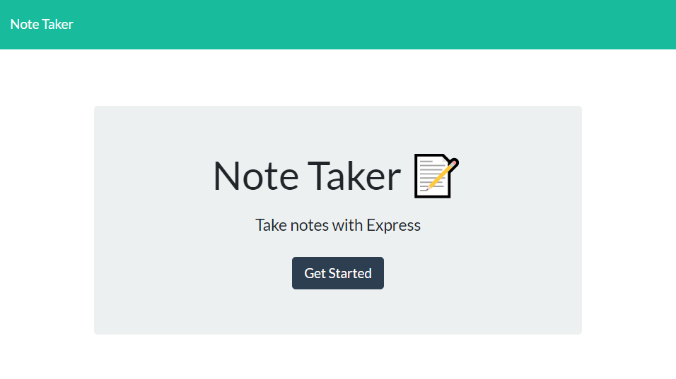

# Note-Taker

## Description
    This repo contains provided starter code for an applicaton that allows you to write and save notes. 
    This application uses an Express.js back end while also saving and retrieving note date from a JSON file. 
    I built this project to test my knowledge of Express.js.
    
## Installation instructions
    Required installations for this applicaton to work will be Nodejs. Included below is a link 
    to instructions on how to properly install Node. 
     https://coding-boot-camp.github.io/full-stack/nodejs/how-to-install-nodejs
     
## Usage
    Below are provided Screen captures of the application. 
    

## Contributions
    In this assignment I was provided with starter code. As a result, my only contributors to name would be the
    UCI coding bootcamp team that provided said starter code.
